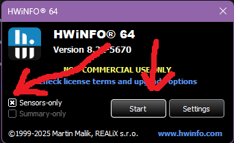
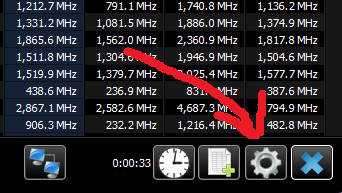
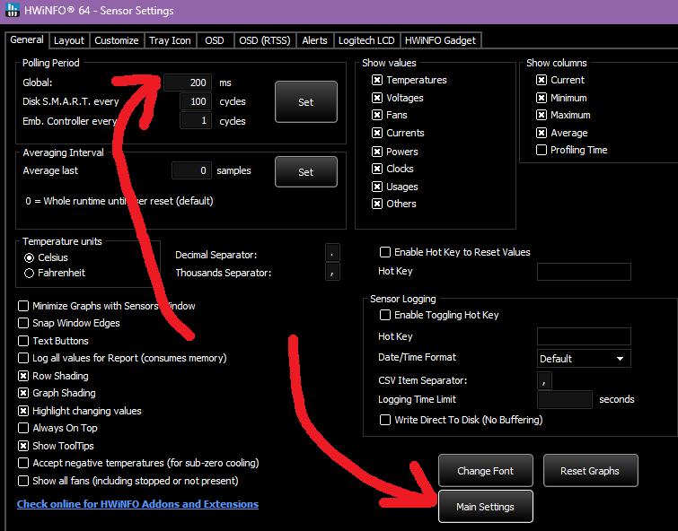
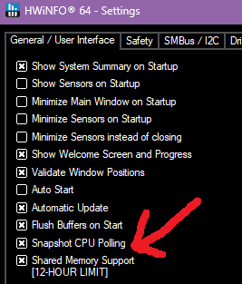
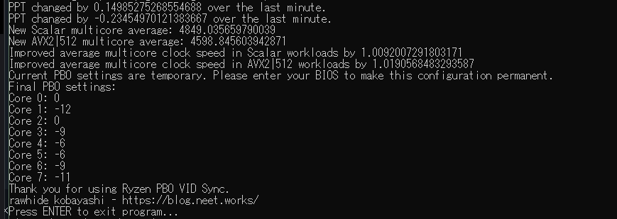

# YOU HAVE BEEN WARNED
This project violates your warranty. Enabling PBO violates you warranty. Undervolting violates your warranty. Claims of stability are representative of my experience, not a guarantee of your future experience. This project requires Administrator access to write to the registers that allow you to modify PBO offsets while in Windows. It is bad practice to run random executables from the Internet as Administrator. Do not run any version of this executable that you did not download directly from this page, or from my mirror, on https://git.neet.works.

## Ryzen PBO VID Synchronizer
An easy to use, no-frills tool for quickly synchronizing your VID in fully multithreaded workloads via PBO offsets on AMD Ryzen CPUs. If you are a normal person, with conventional, ambient cooling, this tool will get you >90% of the way towards your maximum possible stable PBO performance in under an hour, hands-free. This setup is very consistent, and run-to-run variance only has a few values differing by 1 point over multiple tests on my 9950X and 9950X3D.

### Why?
See this blog post for the full rationale behind this tool: [To be filled]

The TL;DR is this:
- Each CCD runs at a single clock speed
- The worst active core on a CCD determines the clock speed of the CCD
- The CPU package receives one voltage level for the core domain
- Desktop Ryzen CPUs do not have internal per-core voltage regulation enabled
- Bad cores can take more offset than good cores
- Some good cores can take almost zero offset before crashing in 1T workloads
- Telling people to put all cores to -30, -20, -15, even -10, is BAD, and you should STOP GIVING PEOPLE ADVICE THAT MAKES THEIR COMPUTERS CRASH.

This tool will gradually bring all cores to a relatively level playing field in multi-threaded workloads without risking your existing stability in lightly/1T workloads. You can continue to optimize from the settings produced by this tool using Curve Shaper on Zen 5, or by continuing to gently nudge the offsets downwards on platforms where Curve Shaper is unavailable. A tool like [CoreCycler](https://github.com/sp00n/corecycler) can help with this.

## Note about compatiblity with 4/6/12-core skus
There is internal logic that makes working with SKUs that have factory-disabled cores not-straightforward. I believe that I have solved any potential issues, but I do not have any of these SKUs on hand. If you have any problems, open an issue. Or, if you do try this with a 4/6/12-core SKU and it works perfectly, let me know so I can remove this notice.

### Requirements:
- .NET Runtime 8.0 - https://dotnet.microsoft.com/en-us/download/dotnet/8.0
- HWiNFO64 - https://www.hwinfo.com/
- AMD Ryzen CPU supported by ZenStates-Core - https://github.com/irusanov/ZenStates-Core

### Installation
1. Download the above prerequisites, and make sure your CPU is supported.
2. Download the latest release from the sidebar.
3. Unzip on a local drive.


### Usage
1. Run HWiNFO
2. Open sensors, ignore summary



3. Click the gear in the sensors window



4. Set the polling period to 200ms
5. Open Main Settings



6. Enable shared memory and snapshot polling



7. Run `ryzen-pbo-vid-sync.exe` as Administrator.
8. Wait until it finishes. It should take no more than twenty minutes, even with 16-core SKUs.
9. Reboot and apply results to BIOS, or use [SMUDebugTool](https://github.com/irusanov/SMUDebugTool/tree/master) / [ryzen-smu-cli](https://github.com/rawhide-kobayashi/ryzen-smu-cli) to re-implement them at a later time.

## My results
Here are the results from running this script on a watercooled 9950X with a Heatkiller Pro IV block and a water temperature of ~23.5*C.

```
Original Scalar multicore average: 5104.19
Original AVX2|512 multicore average: 4346.89
New Scalar multicore average: 5475.90
New AVX2|512 multicore average: 4651.96
Improved average multicore clock speed in Scalar workloads by 1.07x above baseline.
Improved average multicore clock speed in AVX2|512 workloads by 1.07x above baseline.
Original scalar efficiency: 17.91 MHz/w
Original AVX2|512 efficiency: 16.25 MHz/w
New scalar efficiency: 22.56 MHz/w
New AVX2|512 efficiency: 17.14 MHz/w
Enter these settings into your BIOS to make this configuration permanent.
Final PBO settings:
Core 0: -7
Core 1: 0
Core 2: -2
Core 3: -12
Core 4: -10
Core 5: -15
Core 6: -16
Core 7: -20
Core 8: -29
Core 9: -26
Core 10: -30
Core 11: -31
Core 12: -30
Core 13: -31
Core 14: -34
Core 15: -34
```

I also have a 9950X3D, watercooled with the Thermal Grizzly AM5 Mycro Direct-Die Pro. The liquid temperature is controlled at a very consistent 30*C. Here are its results.

```
Original Scalar multicore average: 5112.63
Original AVX2|512 multicore average: 4526.94
New Scalar multicore average: 5391.25
New AVX2|512 multicore average: 4699.10
Improved average multicore clock speed in Scalar workloads by 1.05x above baseline.
Improved average multicore clock speed in AVX2|512 workloads by 1.04x above baseline.
Original scalar efficiency: 21.49 MHz/w
Original AVX2|512 efficiency: 18.11 MHz/w
New scalar efficiency: 25.54 MHz/w
New AVX2|512 efficiency: 18.51 MHz/w
Enter these settings into your BIOS to make this configuration permanent.
Final PBO settings:
Core 0: -19
Core 1: -22
Core 2: -21
Core 3: -23
Core 4: -18
Core 5: -22
Core 6: -21
Core 7: -24
Core 8: 0
Core 9: -9
Core 10: -3
Core 11: -11
Core 12: -9
Core 13: -9
Core 14: -14
Core 15: -13
```

In both of these cases, HTFMax is severely limiting the potential scalar gains... There was ~20*C of thermal headroom on both chips when running scalar workloads by the time the voltages evened out, but they just won't boost higher due to HTFMax. AVX-512 stands to gain less, with this specific tuning methodology, as the initial voltage deltas are much less in the AVX-512 clock speed regime, and it is always thermal throttling, even after tuning. More gains would be had by utilizing Curve Shaper. There are, of course, also gains to be had in scalar instructions using Curve Shaper, but unless you can bypass HTFMax via eClk, which is a whole 'nother can of worms, they are marginal from this point.

In addition, here are the results from a friend's 7800X3D, on an older version of the program.



## Build instructions

1. Clone this repo in VSCode. It should prompt you to install the appropriate C# extensions and SDKs.
2. Open the integrated terminal and run `git submodule update --init --recursive`.
3. The ZenStates-Core repo is missing the x64 folder for InpOut. Download the binaries from [here](https://www.highrez.co.uk/downloads/inpout32/) and place the `x64` folder in `ryzen-pbo-vid-sync\include\ZenStates-Core\External\InpOut`.
4. CTRL + Shift + B